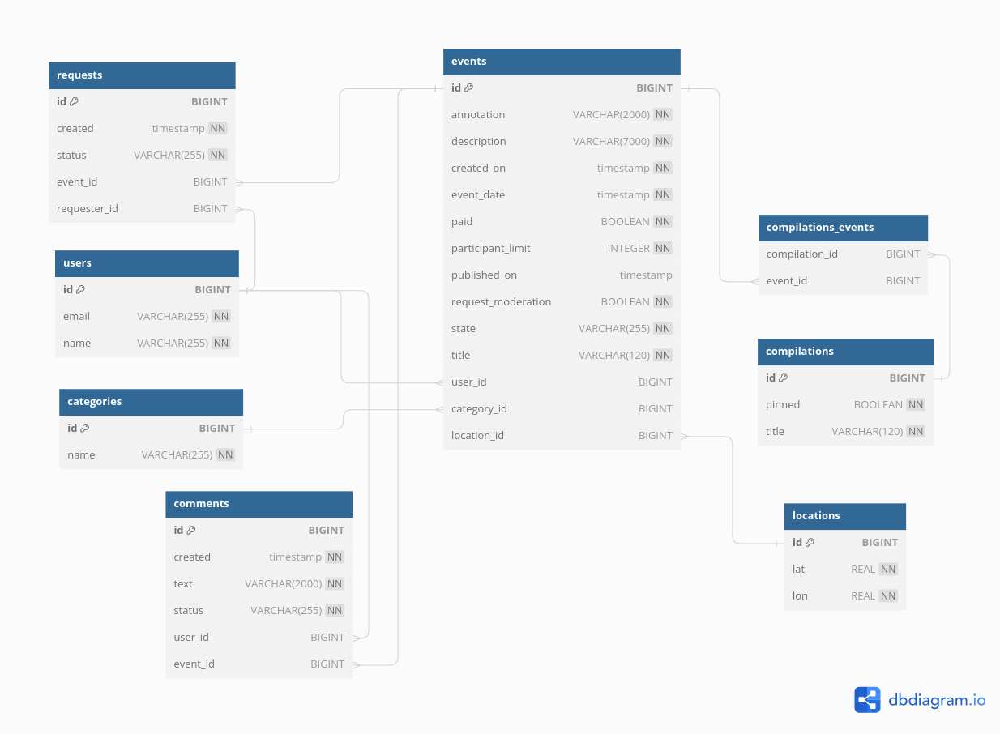

# java-explore-with-me

[Ссылка на PR](https://github.com/hititipi/java-explore-with-me/pull/6)

## Описание
Приложение предоставляет сервис для планирования интересных событий (афиша) и поиска компании для участия в них.

## Endpoints
- [API сервис статистики](./ewm-stats-service-spec.json)
- [API основной сервис](./ewm-main-service-spec.json)
- [API_комментарии](./ewm-main-comments.json)

## Описание БД:

